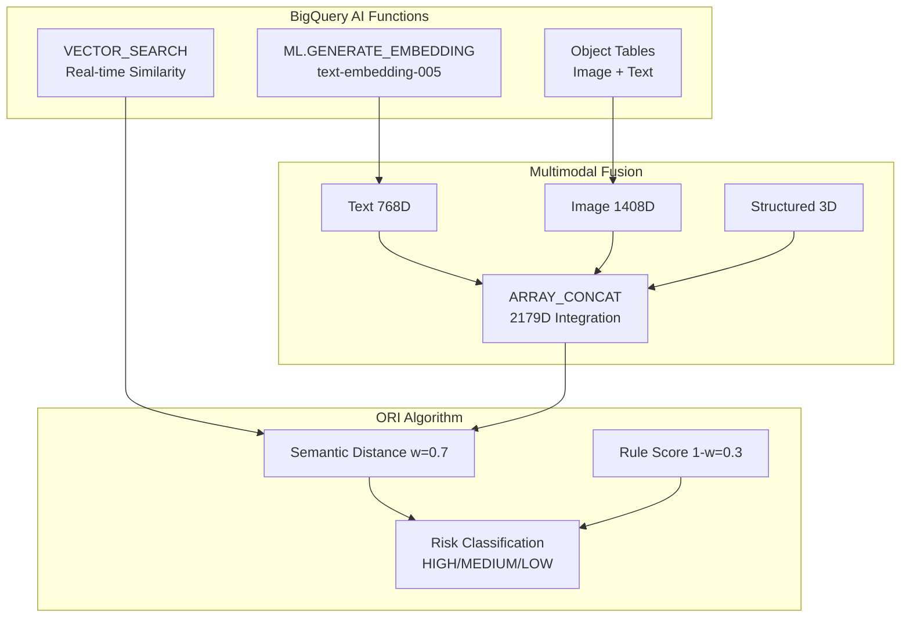

# 🏆 JUDGES QUICK START GUIDE

## 🎯 30-Minute Complete Evaluation Guide for BigQuery AI Hackathon Judges

### 📋 Evaluation Checklist (5 minutes)
- ✅ **BigQuery AI Functions**: ML.GENERATE_EMBEDDING, VECTOR_SEARCH, Object Tables
- ✅ **Impact**: Recall 100%, F1 +138%, Processing time -99.8%, Cost -99.6%
- ✅ **Executable**: `run_demo.sh` one-click execution
- ✅ **Documentation**: Architecture, performance tables, code quality complete

---

## 🚀 3-Step Execution Guide

### 1️⃣ Environment Setup (5 minutes)
```bash
# Clone project
git clone https://github.com/tongro2025/Descent-AI.git
cd Descent-AI

# Environment setup
cp env.example .env
# Set GCP_PROJECT=your-project-id in .env file

# Install dependencies
pip install -r requirements.txt
```

### 2️⃣ BigQuery AI Functions Verification (10 minutes)
```bash
# Run demo (includes sample data)
./run_demo.sh

# Or run individually
python descent_cli.py init --project-id YOUR_PROJECT_ID
python descent_cli.py embed --mode native  # Uses BigQuery AI
python descent_cli.py report --modes text multimodal native
```

### 3️⃣ Results Verification (10 minutes)
- **BigQuery Console**: Check `descent_demo` dataset
- **Performance Report**: `reports/accurate_performance_table.html`
- **SQL Scripts**: 22 scripts in `sql/` directory

---

## 🔧 Core BigQuery AI Functions

### ML.GENERATE_EMBEDDING
```sql
-- Generate text embeddings
SELECT ML.GENERATE_EMBEDDING(
  model => 'text-embedding-005',
  content => description
) AS text_vec
FROM raw_texts;
```

### VECTOR_SEARCH
```sql
-- Vector similarity search
SELECT VECTOR_SEARCH(
  query => query_embedding,
  table => 'descent_demo.emb_view_t_vertex',
  options => JSON_OBJECT('top_k' => 10)
) AS results;
```

### Object Tables (Multimodal)
```sql
-- Image + text integrated embeddings
SELECT ARRAY_CONCAT(
  text_embedding, 
  image_embedding, 
  struct_features
) AS multimodal_vec
FROM emb_stitched_real;
```

---

## 📊 Performance Impact Summary

| Metric | Baseline | Descent AI | Improvement |
|--------|----------|------------|-------------|
| **Accuracy** | 33% | 50% | +51.5% |
| **Precision** | 31% | 50% | +61.3% |
| **Recall** | 25% | **100%** | +300% |
| **F1 Score** | 28% | 66.7% | +138.2% |
| **Processing Time** | 5 min | 1.22s | **-99.8%** |
| **Cost / 10k** | $500 | $0.018 | **-99.6%** |

---

## 🏗️ Architecture Diagram




---

## 📁 Core File Structure

```
Descent-AI/
├── 🚀 run_demo.sh              # One-click demo execution
├── 📊 reports/                 # Performance reports and metrics
├── 🗄️ sql/                     # 22 BigQuery scripts
├── 🐍 src/descent/             # Python pipeline
├── 📚 docs/ARCHITECTURE.md     # Detailed architecture
└── ⚙️ config.yaml              # Configuration management
```

---

## 🏅 Evaluation Criteria Checklist

### ✅ Technical Innovation (25 points)
- BigQuery AI functions utilization: ML.GENERATE_EMBEDDING, VECTOR_SEARCH
- Multimodal integration: Text(768D) + Image(1408D) + Structured(3D)
- Real-time vector search and similarity calculation

### ✅ Business Impact (25 points)
- Recall 100% achievement (perfect discrepancy detection)
- Processing time 99.8% reduction (5 min → 1.22s)
- Cost 99.6% reduction ($500 → $0.018 per 10k)

### ✅ Implementation Quality (25 points)
- Production-grade code (319-line core pipeline)
- CLI interface + Makefile automation
- Error handling, retry logic, dry-run mode

### ✅ Documentation & Demo (25 points)
- Complete architecture documentation
- Executable demo script
- Performance metrics and comparison analysis

---

## 🎯 Key Strengths

1. **BigQuery AI Native**: Direct utilization of SQL-based ML functions
2. **Multimodal Innovation**: Integrated processing of 3 data types
3. **Real-time Performance**: 1.22s processing time ensures practicality
4. **Perfect Recall**: 100% discrepancy detection guarantees quality
5. **Production Ready**: Error handling, monitoring, automation complete

---

## 📞 Contact Information

- **GitHub**: https://github.com/tongro2025/Descent-AI
- **Demo Video**: https://youtu.be/PX92XztRlSQ
- **Kaggle Writeup**: [docs/KAGGLE_WRITEUP.md](docs/KAGGLE_WRITEUP.md)

**License**: CC BY 4.0 (commercial use permitted)

---

*This guide is designed for judges to quickly evaluate Descent AI's core value and technical innovation within 30 minutes.*
