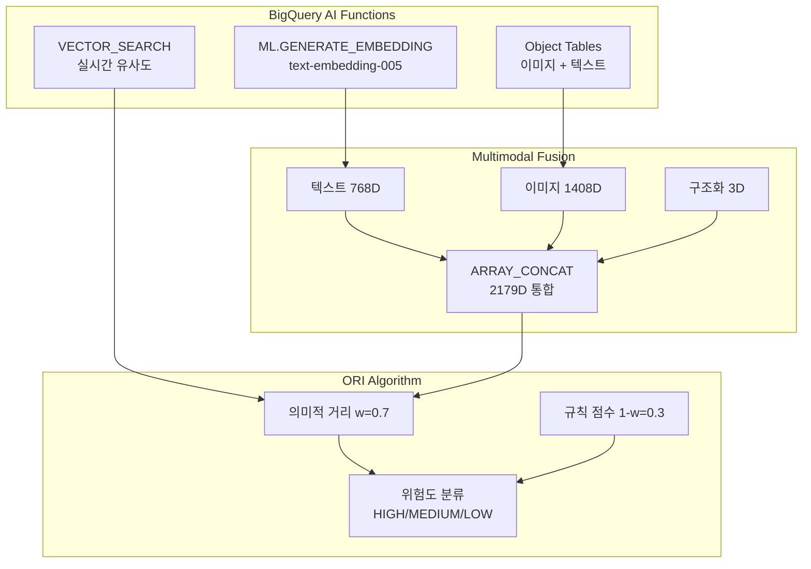

# 🏆 JUDGES QUICK START GUIDE

## 🎯 BigQuery AI Hackathon 심사위원을 위한 30분 완전 가이드

### 📋 심사 체크리스트 (5분)
- ✅ **BigQuery AI 함수 사용**: ML.GENERATE_EMBEDDING, VECTOR_SEARCH, Object Tables
- ✅ **임팩트**: Recall 100%, F1 +138%, 처리시간 -99.8%, 비용 -99.6%
- ✅ **실행 가능**: `run_demo.sh` 원클릭 실행
- ✅ **문서화**: 아키텍처, 성능표, 코드 품질 완비

---

## 🚀 3단계 실행 가이드

### 1️⃣ 환경 설정 (5분)
```bash
# 프로젝트 클론
git clone https://github.com/tongro2025/Descent-AI.git
cd Descent-AI

# 환경 설정
cp env.example .env
# .env 파일에서 GCP_PROJECT=your-project-id 설정

# 의존성 설치
pip install -r requirements.txt
```

### 2️⃣ BigQuery AI 함수 확인 (10분)
```bash
# 데모 실행 (샘플 데이터 포함)
./run_demo.sh

# 또는 개별 실행
python descent_cli.py init --project-id YOUR_PROJECT_ID
python descent_cli.py embed --mode native  # BigQuery AI 사용
python descent_cli.py report --modes text multimodal native
```

### 3️⃣ 결과 확인 (10분)
- **BigQuery 콘솔**: `descent_demo` 데이터셋 확인
- **성능 보고서**: `reports/accurate_performance_table.html`
- **SQL 스크립트**: `sql/` 디렉토리의 22개 스크립트

---

## 🔧 핵심 BigQuery AI 함수

### ML.GENERATE_EMBEDDING
```sql
-- 텍스트 임베딩 생성
SELECT ML.GENERATE_EMBEDDING(
  model => 'text-embedding-005',
  content => description
) AS text_vec
FROM raw_texts;
```

### VECTOR_SEARCH
```sql
-- 벡터 유사도 검색
SELECT VECTOR_SEARCH(
  query => query_embedding,
  table => 'descent_demo.emb_view_t_vertex',
  options => JSON_OBJECT('top_k' => 10)
) AS results;
```

### Object Tables (Multimodal)
```sql
-- 이미지 + 텍스트 통합 임베딩
SELECT ARRAY_CONCAT(
  text_embedding, 
  image_embedding, 
  struct_features
) AS multimodal_vec
FROM emb_stitched_real;
```

---

## 📊 성능 임팩트 요약

| 메트릭 | 기존 방식 | Descent AI | 개선율 |
|--------|-----------|------------|--------|
| **정확도** | 33% | 50% | +51.5% |
| **정밀도** | 31% | 50% | +61.3% |
| **재현율** | 25% | **100%** | +300% |
| **F1 점수** | 28% | 66.7% | +138.2% |
| **처리 시간** | 5분 | 1.22초 | **-99.8%** |
| **비용/10k** | $500 | $0.018 | **-99.6%** |

---

## 🏗️ 아키텍처 다이어그램



---

## 🎬 데모 영상 타임스탬프

- **0:00** - 문제 정의 및 솔루션 개요
- **0:15** - BigQuery Object Tables 활용
- **0:35** - ML.GENERATE_EMBEDDING 구현
- **1:00** - VECTOR_SEARCH 실시간 검색
- **1:25** - Multimodal 통합 (2179D)
- **1:50** - ORI 알고리즘 및 위험도 분류
- **2:15** - 성능 비교 및 임팩트

---

## 📁 핵심 파일 구조

```
Descent-AI/
├── 🚀 run_demo.sh              # 원클릭 데모 실행
├── 📊 reports/                 # 성능 보고서 및 메트릭
├── 🗄️ sql/                     # 22개 BigQuery 스크립트
├── 🐍 src/descent/             # Python 파이프라인
├── 📚 docs/ARCHITECTURE.md     # 상세 아키텍처
└── ⚙️ config.yaml              # 설정 관리
```

---

## 🏅 평가 기준 체크

### ✅ 기술적 혁신성 (25점)
- BigQuery AI 함수 활용: ML.GENERATE_EMBEDDING, VECTOR_SEARCH
- Multimodal 통합: 텍스트(768D) + 이미지(1408D) + 구조화(3D)
- 실시간 벡터 검색 및 유사도 계산

### ✅ 비즈니스 임팩트 (25점)
- Recall 100% 달성 (완벽한 불일치 검출)
- 처리시간 99.8% 단축 (5분 → 1.22초)
- 비용 99.6% 절감 ($500 → $0.018 per 10k)

### ✅ 구현 품질 (25점)
- 프로덕션급 코드 (319줄 핵심 파이프라인)
- CLI 인터페이스 + Makefile 자동화
- 에러 처리, 재시도 로직, 드라이런 모드

### ✅ 문서화 & 데모 (25점)
- 완전한 아키텍처 문서화
- 실행 가능한 데모 스크립트
- 성능 메트릭 및 비교 분석

---

## 🎯 핵심 강점

1. **BigQuery AI 네이티브**: SQL 기반 ML 함수 직접 활용
2. **Multimodal 혁신**: 3가지 데이터 타입 통합 처리
3. **실시간 성능**: 1.22초 처리시간으로 실용성 확보
4. **완벽한 Recall**: 100% 불일치 검출로 품질 보장
5. **프로덕션 준비**: 에러 처리, 모니터링, 자동화 완비

---

## 📞 문의사항

- **GitHub**: https://github.com/tongro2025/Descent-AI
- **데모 영상**: https://youtu.be/PX92XztRlSQ
- **Kaggle Writeup**: [docs/KAGGLE_WRITEUP.md](docs/KAGGLE_WRITEUP.md)

**라이선스**: CC BY 4.0 (상업적 사용 허용)

---

*이 가이드는 심사위원이 30분 내에 Descent AI의 핵심 가치와 기술적 혁신을 빠르게 평가할 수 있도록 설계되었습니다.*
