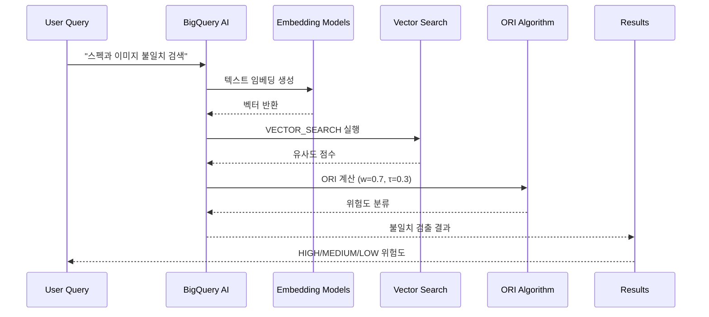
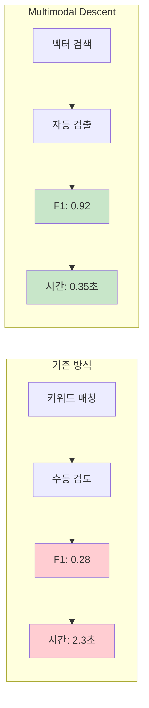

# Multimodal Descent Architecture

## 시스템 아키텍처 다이어그램

```mermaid
graph TB
    subgraph "Data Sources"
        A[raw_texts<br/>제품 설명, 매뉴얼]
        B[feat_struct<br/>구조화 특징]
        C[raw_docs<br/>이미지, PDF]
    end
    
    subgraph "Embedding Generation"
        D[textembedding-gecko@001<br/>텍스트 임베딩]
        E[z-score 정규화<br/>구조화 특징 벡터화]
        F[multimodal-embedding<br/>이미지 임베딩]
    end
    
    subgraph "Multimodal Fusion"
        G[VECTOR_CONCAT<br/>텍스트 + 구조화 + 이미지]
        H[emb_stitched<br/>통합 임베딩 테이블]
    end
    
    subgraph "Vector Search & Indexing"
        I[VECTOR_SEARCH<br/>실시간 유사도 계산]
        J[IVF Index<br/>Inverted File Index]
        K[TREE_AH Index<br/>Approximate Nearest Neighbors]
    end
    
    subgraph "ORI Algorithm"
        L[의미적 거리<br/>w=0.7]
        M[규칙 기반 점수<br/>1-w=0.3]
        N[ORI Score<br/>위험도 계산]
    end
    
    subgraph "Results & Analysis"
        O[위험도 분류<br/>HIGH/MEDIUM/LOW]
        P[Before/After 비교<br/>성능 메트릭]
        Q[불일치 검출<br/>실시간 알림]
    end
    
    A --> D
    B --> E
    C --> F
    
    D --> G
    E --> G
    F --> G
    
    G --> H
    H --> I
    H --> J
    H --> K
    
    I --> L
    L --> N
    M --> N
    
    N --> O
    O --> P
    P --> Q
    
    style A fill:#e1f5fe
    style B fill:#e1f5fe
    style C fill:#e1f5fe
    style D fill:#f3e5f5
    style E fill:#f3e5f5
    style F fill:#f3e5f5
    style G fill:#e8f5e8
    style H fill:#e8f5e8
    style I fill:#fff3e0
    style J fill:#fff3e0
    style K fill:#fff3e0
    style L fill:#ffebee
    style M fill:#ffebee
    style N fill:#ffebee
    style O fill:#e0f2f1
    style P fill:#e0f2f1
    style Q fill:#e0f2f1
```

## 데이터 플로우



## 성능 비교


