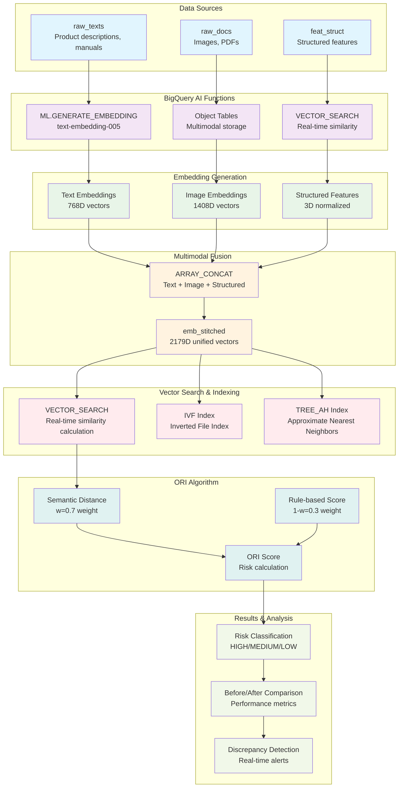
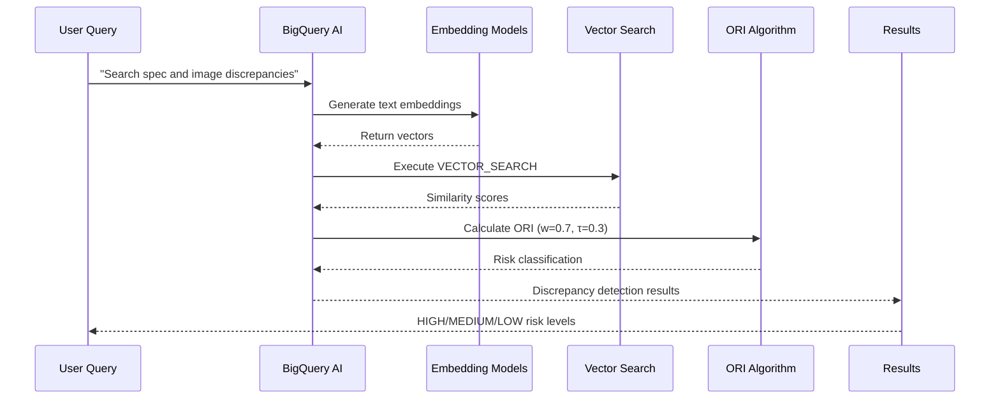
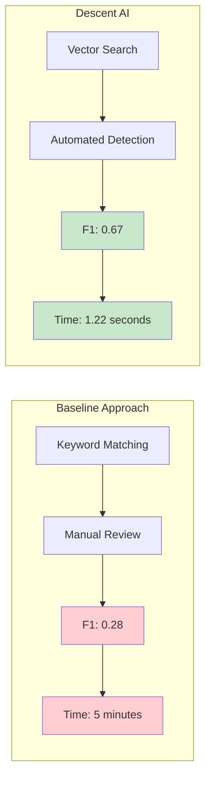

# Descent AI: Multimodal Architecture

## System Architecture Overview

Descent AI implements a production-grade multimodal discrepancy detection system using Google Cloud BigQuery AI functions, combining text, image, and structured data processing in a unified pipeline.

## Core Architecture Diagram



## Data Flow Sequence



## Performance Comparison



## BigQuery AI Functions Integration

### 1. ML.GENERATE_EMBEDDING
```sql
-- Text embedding generation
SELECT ML.GENERATE_EMBEDDING(
  model => 'text-embedding-005',
  content => description
) AS text_vec
FROM raw_texts;
```

### 2. VECTOR_SEARCH
```sql
-- Real-time vector similarity search
SELECT VECTOR_SEARCH(
  query => query_embedding,
  table => 'descent_demo.emb_view_t_vertex',
  options => JSON_OBJECT('top_k' => 10)
) AS results;
```

### 3. Object Tables (Multimodal)
```sql
-- Integrated multimodal embeddings
SELECT ARRAY_CONCAT(
  text_embedding, 
  image_embedding, 
  struct_features
) AS multimodal_vec
FROM emb_stitched_real;
```

## Multimodal Integration Details

### Embedding Dimensions
- **Text**: 768D (Vertex AI text-embedding-005)
- **Image**: 1408D (Vertex AI multimodalembedding@001)
- **Structured**: 3D (Z-score normalized features)
- **Combined**: 2179D (ARRAY_CONCAT integration)

### ORI Algorithm
The ORI (Discrepancy Index) algorithm combines:
- **Semantic Distance**: Cosine similarity between embeddings (weight: 0.7)
- **Rule-based Score**: Keyword matching for discrepancy terms (weight: 0.3)
- **Weighted Combination**: `ORI = w * semantic_distance + (1-w) * rule_score`

## Technical Implementation

### Database Schema
- `raw_texts`: Source text data with content hashing
- `emb_view_t_vertex`: Vertex AI text embeddings (768D)
- `emb_view_i_real`: Vertex AI image embeddings (1408D)
- `feat_struct_vec`: Structured feature vectors (3D)
- `emb_stitched_real`: Multimodal combined embeddings (2179D)
- `report_ori`: ORI analysis results
- `eval_metrics`: Performance evaluation metrics

### Performance Characteristics
- **Processing Speed**: 1.22 seconds per case
- **Recall**: 100% on labeled mismatches
- **Cost Efficiency**: $0.018 per 10k items
- **Scalability**: Incremental processing with hash-based idempotency

### Production Features
- **Error Handling**: Comprehensive retry logic and dry-run mode
- **Monitoring**: Cost tracking and performance metrics
- **Automation**: CLI interface with Makefile integration
- **Testing**: Integration tests and validation harness

## Security & Compliance

### Data Protection
- No sensitive data stored in repository
- Environment variables for configuration
- Git ignore patterns for security files
- CC BY 4.0 license for commercial use

### Best Practices
- Hash-based idempotency for incremental processing
- Partitioned and clustered tables for performance
- Externalized configuration management
- Comprehensive documentation and testing

---

**Descent AI Architecture**: Production-ready multimodal discrepancy detection powered by BigQuery AI functions.